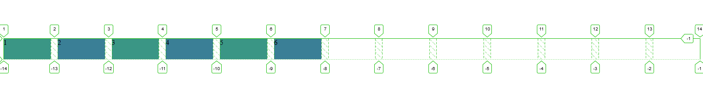
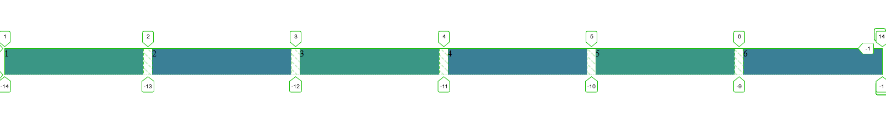

CSS Grid is one of the most powerful layout systems to hit CSS. 
It's packed with features that allow us to efficiently achieve responsive
 layouts with ease. Normally, the responsiveness of layouts is handled by 
 media queries. Thankfully in this specific case, we'll be turning our 
 backs to media queries.

What's truly amazing, is the ability to define our layout and have 
it poses responsive behavior with a single line of CSS. Before we 
start messing about, let's cover a few key features that allow us 
to create responsive layouts and get familiar with how we'll be 
using them.

### Minmax()

The minmax() function gives us the ability to define the size of 
our grid within a minimum and maximum range that adapts to our 
viewport. The function begins with **"minmax"**. It takes two 
arguments, the minimum value for the first argument and the 
maximum for the second. Both arguments are comma seperated and
 can take any static or dynamic value (px, rem, %, fr unit).

 ```css
minmax(min, max);
```

>**Please note, the minimum value cannot be larger than the maximum.**

In order to use this function, we apply it as the value to the 
grid-template-columns or grid-template-rows properties 
(both can be applied, but in most cases you'll be aiming for 
fluid columns):

```css
grid-template-columns: minmax(250px, 800px);
```

The example above isn't too practical and could use a bit more 
flexibility. Instead of manually writing minmax for every 
column, we'll use repeat(). This function does exactly what 
it implies, repeats. First it takes the number of repetitions 
then the size for each repetition.

```css
grid-template-columns: repeat(6, minmax(250px, 1fr));
```

What we're saying above is "give me 6 columns that have a minimum 
of 250px and grow to a maximum of 1 "fraction" of the available space.

[CSS-Tricks](https://css-tricks.com/introduction-fr-css-unit/) has 
an amazing intro to "fr" units if you want to learn more. 

### Auto-Sizing

This allows the browser to handle the sizing and wrapping of columns 
while you sit back and enjoy. There are two keywords used to achieve 
this. 

**auto-fill**: Fills up the row with as many 
columns as possible. If there is enough space for a column and that 
column is empty, it will still show. 



**auto-fit**: Fills up the row with as many columns as possible **but** 
expands existing columns to fill the row. If there is no more space, columns 
will move to another row. Empty columns will not take any space. 



With the given example, it's understandable to still be a bit lost when comparing 
the two. Think of it like this: 

- **auto-fill** is someone stretching their arms out to yawn in a 
very annoying way. The people sitting in the same row will move 
further down the row leaving **empty space** to avoid getting hit. 

- **auto-fit** is someone stretching their arms out to yawn in a 
very annoying way, but the people sitting in the same row will 
spread out as much as they can and if there's no more room for 
the last person, they'll just create their own row. 

**Note**: The lines and numbers you see on each grid item are 
part of the inspector grid tool within Firefox. It's highly 
recommended to use Firefox when working with CSS Grid, as it 
helps to visualize the grid.

### Creating our grid

Now that we know what **minmax()** is and **auto-sizing**, 
let's make our grid. 

This will be our HTML with all the items we want to place 
within our layout. We want to create a parent div (grid container) 
that contains six items (grid items):

```html
<div class="container">
  <div class="grid-cell">1</div>
  <div class="grid-cell">2</div>
  <div class="grid-cell">3</div>
  <div class="grid-cell">4</div>
  <div class="grid-cell">5</div>
  <div class="grid-cell">6</div>
</div>
```

Within our CSS, let's set up our grid with everything we've learned.

```css
.container {
  display: grid;
  grid-template-columns: repeat(auto-fit, minmax(250px, 1fr));
  grid-gap: 1rem; 
}

.grid-cell:nth-child(even) {
  background: #3a7f96;
}

.grid-cell:nth-child(odd) {
  background: #3a9685;
}
```